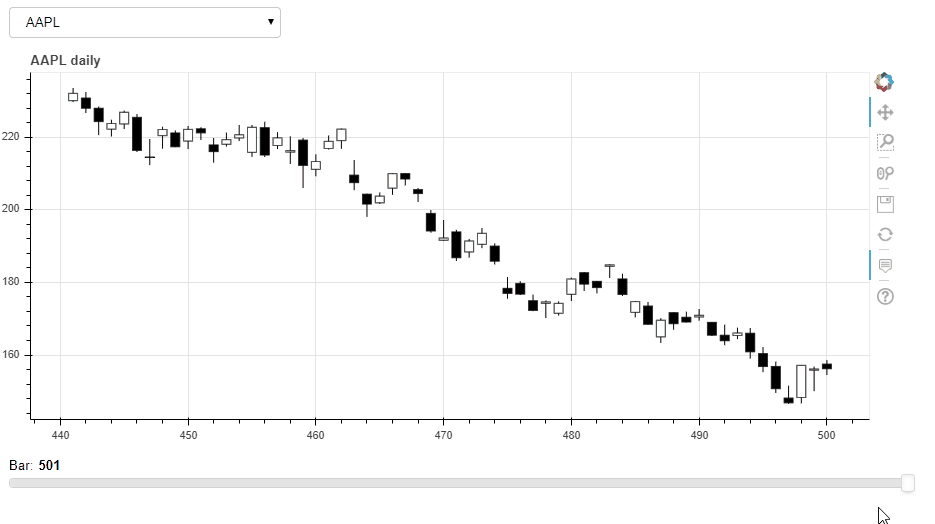

## Creating candlestick charts with range slider using bokeh

This code is meant to showcase a part of the workflow specific to technical analysis:
* connecting to a sql database to extract price data for a specific trading instrument, and
* plotting a candlestick chart with a range slider and a tooltip for detailed price info

For illustration I'm using daily OHLC price data for two instruments (EURUSD currency pair, and Apple stock) stored in a sqlite database. Each instrument represents a table in the db. The script can easily be adopted to plot from csv files, assuming they contain the columns `date`, `open`, `high`, `low` & `close`.

### Usage:
Required dependencies:
* `bokeh`
* `pandas`

To use with `pipenv`, run: 
* `pip install pipenv` to install `pipenv`
* `pipenv install` to install dependencies
* `bokeh serve --show plotting.py` to open in browser

### Disclaimer:
This project is for education purpose and does not represent financial advice, nor should it be used in trading applications.
